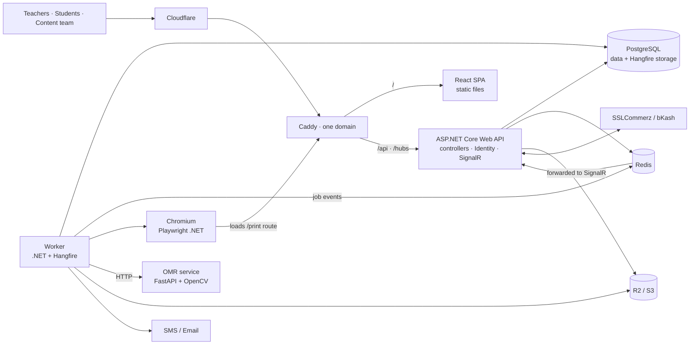

# Technical Specification — e-proshno

Stack decision and trade-offs: `docs/adr/0001-aspnet-react-stack.md`.

> **Runtime:** .NET 8 (LTS). Microsoft support ends **10 November 2026**. Keep the code upgrade-ready (ADR 0001)
> and complete the move to .NET 10 LTS in week 8, before any production launch.

## 1. Stack sheet
### 1.1 Back end
| Concern | Choice | Notes |
|---|---|---|
| Runtime | .NET 8 (LTS), C# 12 | SDK pinned in `global.json`; `net8.0`, `Nullable`, `TreatWarningsAsErrors` in `Directory.Build.props`; versions in `Directory.Packages.props`. Upgrade to .NET 10 in week 8 |
| Web API | ASP.NET Core Web API, controllers + feature folders | Thin controllers; logic in feature handlers |
| API description | Swashbuckle.AspNetCore + Scalar UI | `/swagger/v1/swagger.json` feeds the front-end generator (built-in `AddOpenApi()` is .NET 9+) |
| Data access | EF Core 8 + `Npgsql.EntityFrameworkCore.PostgreSQL` 8 + `EFCore.NamingConventions` | snake_case, jsonb, `uuid[]`, pg_trgm |
| Ids | UUIDNext (UUIDv7) behind `IdGen.New()` in Core | Time-ordered keys; becomes `Guid.CreateVersion7()` after the .NET 10 upgrade |
| Auth | ASP.NET Core Identity (Guid keys), cookie authentication, antiforgery | Phone OTP through Identity token providers |
| Authorization | Policy-based with a custom `PermissionRequirement` | `[HasPermission(Permissions.SetCreate)]` |
| Validation | FluentValidation + an action filter | Returns `ValidationProblemDetails` |
| Background jobs | Hangfire + `Hangfire.PostgreSql` | Retries, scheduled + recurring jobs, admin-only dashboard |
| Realtime | SignalR (+ Redis pub/sub bridge from Worker) | PDF ready, OMR batch progress |
| Caching | FusionCache (memory + Redis distributed layer) | Taxonomy, entitlements; stampede protection (`HybridCache` needs .NET 9+) |
| Rate limiting | Built-in ASP.NET Core rate limiting middleware | OTP, login, exam autosave |
| PDF | `Microsoft.Playwright` (Chromium) in the Worker | Papers, OMR sheets, invoices |
| Excel / Word / PDF import | ClosedXML, DocumentFormat.OpenXml, pandoc CLI, UglyToad.PdfPig | pandoc converts .docx to text + TeX math; runs as a sandboxed external process in the Worker (GPL tool, not linked) |
| Images | SkiaSharp | Re-encode and resize uploaded and imported images |
| Storage | AWSSDK.S3 against Cloudflare R2 / MinIO | Presigned upload/download URLs |
| Outbound HTTP | `IHttpClientFactory` typed clients + `Microsoft.Extensions.Http.Resilience` | No automatic retries on non-idempotent payment calls |
| Logging | Serilog (console, Seq in dev), OpenTelemetry, Sentry | |
| Tests | xUnit v3, Shouldly, `Testcontainers.PostgreSql`, `WebApplicationFactory`, UglyToad.PdfPig | |

### 1.2 Front end
| Concern | Choice | Notes |
|---|---|---|
| Build | Vite + React + TypeScript strict | Dev proxy for `/api` and `/hubs` |
| Routing | React Router with lazy route modules | Separate layouts: app, admin, exam portal, print |
| Server state | TanStack Query | Query keys come from Orval |
| API client | Orval → `src/lib/api/` (fetch client, TanStack Query hooks, zod schemas) | `pnpm api:gen` |
| UI | shadcn/ui (Radix primitives) + Tailwind CSS + lucide-react | Sidebar, Command, Dialog, Sheet, Form, Sonner |
| Tables / charts | TanStack Table, Recharts via shadcn charts | |
| Forms | react-hook-form + zod | |
| Rich text | TipTap + KaTeX | Admin question editor |
| Realtime | `@microsoft/signalr` | Falls back to polling job status |
| Client state | Zustand, only where needed (print-editor settings) | |
| Fonts | `@fontsource/hind-siliguri`, `@fontsource/noto-serif-bengali` | Self-hosted |
| Tests | Vitest + React Testing Library + MSW; Playwright E2E + visual snapshots | |

### 1.3 Services and infrastructure
| Concern | Choice |
|---|---|
| OMR | Python 3.12, FastAPI, OpenCV (headless), NumPy, pypdfium2 |
| Database | PostgreSQL 16+ with `pg_trgm` |
| Cache / pub-sub | Redis |
| Object storage | Cloudflare R2 (prod), MinIO (dev) |
| Payments | SSLCommerz or bKash Tokenized Checkout |
| SMS / Email | Local Bangladesh SMS gateway / Resend or Amazon SES |
| Reverse proxy | Caddy (TLS, same-origin routing, SPA fallback) |
| Hosting | Docker Compose on a Singapore-region VPS behind Cloudflare |
| CI/CD | GitHub Actions (backend + frontend + omr jobs) |

## 2. Architecture

- **One origin:** Caddy serves the SPA at `/` (fallback to `index.html`) and proxies `/api/*` and `/hubs/*` to the API.
  In development, Vite's `server.proxy` does the same (`ws: true` for hubs). Result: HttpOnly cookie auth, no CORS.
- **Worker** is a separate .NET host running the Hangfire server. It is the only process that launches Chromium or calls
  the OMR service. It publishes job events to Redis; the API forwards them to SignalR user groups. Clients fall back to
  polling `GET /api/v1/jobs/{id}`.
- **Dependency rule:** `Core` ← `Infrastructure` ← `Api` / `Worker`. Core references no infrastructure packages.

## 3. Back-end conventions
### 3.1 Feature slice
One file per use case: `backend/src/EProshno.Api/Features/<Area>/<UseCase>.cs`.
```csharp
namespace EProshno.Api.Features.QuestionSets;

public static class CreateQuestionSet
{
    public sealed record Request(string Title, Guid LevelId, Guid SubjectId, Guid[] ChapterIds,
        QuestionType Type, int TargetCount, int DurationMin, decimal FullMarks);

    public sealed record Response(Guid Id);

    public sealed class Validator : AbstractValidator<Request>
    {
        public Validator()
        {
            RuleFor(x => x.Title).NotEmpty().MaximumLength(120);
            RuleFor(x => x.ChapterIds).NotEmpty();
            RuleFor(x => x.TargetCount).InclusiveBetween(1, 200);
            RuleFor(x => x.DurationMin).InclusiveBetween(5, 300);
        }
    }

    public sealed class Handler(AppDbContext db, ITenantContext tenant, IEntitlements entitlements, TimeProvider clock)
    {
        public async Task<Response> Handle(Request req, CancellationToken ct)
        {
            if (!await entitlements.HasSubjectAccessAsync(tenant.InstitutionId, req.SubjectId, ct))
                throw new AppException("subscription.subject_required", "নির্বাচিত বিষয়ে সাবস্ক্রিপশন নেই।", 402);

            var now = clock.GetUtcNow();
            var set = new QuestionSet
            {
                Id = IdGen.New(), InstitutionId = tenant.InstitutionId, CreatedById = tenant.UserId,
                Title = req.Title, LevelId = req.LevelId, SubjectId = req.SubjectId, ChapterIds = req.ChapterIds,
                Type = req.Type, TargetCount = req.TargetCount, DurationMin = req.DurationMin,
                FullMarks = req.FullMarks, Settings = new PaperSettings(), CreatedAt = now, UpdatedAt = now,
            };
            db.QuestionSets.Add(set);
            await db.SaveChangesAsync(ct);
            return new Response(set.Id);
        }
    }
}
```
```csharp
[ApiController, Route("api/v1/question-sets")]
public sealed class QuestionSetsController : ControllerBase
{
    [HttpPost, HasPermission(Permissions.SetCreate)]
    [ProducesResponseType<CreateQuestionSet.Response>(StatusCodes.Status201Created)]
    [ProducesResponseType<ValidationProblemDetails>(StatusCodes.Status400BadRequest)]
    [ProducesResponseType<ProblemDetails>(StatusCodes.Status402PaymentRequired)]
    public async Task<IActionResult> Create(CreateQuestionSet.Request req,
        [FromServices] CreateQuestionSet.Handler handler, CancellationToken ct)
    {
        var res = await handler.Handle(req, ct);
        return CreatedAtAction(nameof(Get), new { id = res.Id }, res);
    }
}
```

### 3.2 Rules
- Handlers and validators are registered by assembly scan (Scrutor) as scoped services.
- A global `ValidationFilter` resolves `IValidator<T>` for action arguments and returns `ValidationProblemDetails`.
- `AppException(code, messageBn, status)` → `IExceptionHandler` → ProblemDetails `{ type, title, status, detail, code, traceId }`.
- Reads: `AsNoTracking()` + `Select` projection straight into DTO records. Never return entities.
- Enums serialise as strings (`JsonStringEnumConverter`) so TypeScript gets string unions.
- Swashbuckle setup: `SupportNonNullableReferenceTypes()`, `NonNullableReferenceTypesAsRequired()`, and
  `CustomSchemaIds(t => t.DeclaringType is null ? t.Name : t.DeclaringType.Name + t.Name)` so nested feature records
  (`CreateQuestionSet.Request`) get unique, readable names (`CreateQuestionSetRequest`) in the generated client.
- Pagination: keyset on `Id` (Guid v7 is time-ordered): `?cursor=&limit=` → `{ items, nextCursor }`.
- Routes: `/api/v1/<kebab-plural>`; admin under `/api/v1/admin/...`; Chromium render endpoints under `/api/v1/render/...` (HMAC token).
- Audit: an EF `SaveChangesInterceptor` writes `AuditLog` rows for tenant data changes.

## 4. Front-end conventions
```
src/app/router.tsx         route tree with lazy() modules
src/app/layouts/           AppShell (shadcn Sidebar), AdminLayout, ExamLayout (/e/:examCode), PrintLayout (/print/*)
src/features/generate/     SetupPage, SetHeaderPage, PickerPage, PrintEditorPage + components
src/lib/api/               generated — do not edit
```
```tsx
// features/generate/setup-form.tsx
const navigate = useNavigate();
const createSet = useCreateQuestionSet();                      // generated by Orval
const form = useForm<SetupValues>({ resolver: zodResolver(setupSchema) });

const onSubmit = form.handleSubmit((values) =>
  createSet.mutate({ data: values }, {
    onSuccess: ({ id }) => navigate(`/sets/${id}`),
    onError: (err) => applyProblemDetails(form, err),          // maps ValidationProblemDetails to fields, toasts the rest
  }),
);
```
- Never call `fetch` directly; an Orval custom mutator adds `credentials: 'include'` and the `X-XSRF-TOKEN` header.
- Session: `useMe()` (GET `/api/v1/me`) in a route guard; a 401 redirects to `/login`.
- UI strings from `src/i18n/bn.ts`; numbers/dates through `src/lib/bn.ts`.
- Add shadcn components with `pnpm dlx shadcn@latest add <name>`; theme only through CSS variables in `src/index.css`.
- Print routes render without the app shell and set `data-paper-ready` when fonts, images and math are ready.

## 5. Auth, multi-tenancy and permissions
- `AppUser : IdentityUser<Guid>`. Cookie `ep.auth`: HttpOnly, Secure, SameSite=Lax, 14-day sliding expiry.
- Login with email + password, or phone OTP: `UserManager.GenerateUserTokenAsync(user, TokenOptions.DefaultPhoneProvider, "login")`
  → SMS → verify; OTP endpoints rate-limited per phone and per IP.
- Antiforgery: `GET /api/v1/antiforgery` sets a readable `XSRF-TOKEN` cookie; unsafe methods must send `X-XSRF-TOKEN`.
- The active institution is the `inst` claim in the auth cookie; switching institution re-issues the cookie after checking membership.
- `ITenantContext` (scoped) exposes `UserId` and `InstitutionId` from claims.
- Global query filter for every `ITenantOwned` entity:
```csharp
public sealed class AppDbContext(DbContextOptions<AppDbContext> options, ITenantContext tenant)
    : IdentityDbContext<AppUser, IdentityRole<Guid>, Guid>(options)
{
    // Must be a DbContext member so EF evaluates it per request instead of caching a constant.
    private Guid? CurrentInstitutionId => tenant.InstitutionId;

    private void ApplyTenantFilter<T>(ModelBuilder b) where T : class, ITenantOwned =>
        b.Entity<T>().HasQueryFilter(e => e.InstitutionId == CurrentInstitutionId);
    // OnModelCreating: call ApplyTenantFilter<T> for each ITenantOwned entity type (via reflection).
}
```
- `Question` is **not** tenant-owned (platform questions have `BankId = null`; custom questions belong to a tenant-owned `QuestionBank`); always query through `Questions.VisibleTo(institutionId, userId)`.
- Institution roles `Owner`, `Admin`, `Teacher`; permission keys `question.create`, `set.create`, `set.delete`, `exam.manage`,
  `omr.evaluate`, `student.manage`, `teacher.manage`, `billing.manage`, `report.view`, `bank.manage`, `bank.share`, `bank.approve`, `question.import`.
- Platform roles (Identity roles): `SuperAdmin`, `ContentEditor`, `ContentReviewer`, `Support`.
- Student portal uses a separate cookie scheme `ep.student`, issued after exam code + roll + PIN/OTP; policy `StudentOnly`.
- Chromium render token: HMAC-SHA256 over `resource|id|variant|exp` with `Render:Secret`, 2-minute lifetime.

## 6. Data model
### 6.1 Core entities
| Entity | Key fields |
|---|---|
| `Level` | Id, Slug, NameBn, Sort |
| `Subject` | Id, LevelId, InstitutionId? (null = official syllabus, set = custom syllabus), NameBn, Code?, Paper?, Sort |
| `Chapter` | Id, SubjectId, InstitutionId?, Number, NameBn |
| `Topic` | Id, ChapterId, InstitutionId?, NameBn, Sort |
| `Board` | Id, Code, NameBn, ShortBn (ঢা, রা, য, কু, চ, ব, সি, দি, ম) |
| `Stimulus` | Id, Content (jsonb) — উদ্দীপক for a CQ or a CommonInfo MCQ group |
| `Question` | see below |
| `QuestionBank` · tenant | Id, InstitutionId, OwnerId, Name, Description?, LevelId?, SubjectId?, Sharing (Private/Institution), RequireApproval, IsDefault, QuestionCount, CreatedAt, UpdatedAt, ArchivedAt? |
| `QuestionTag` · tenant / `QuestionTagLink` | Id, InstitutionId, Name / QuestionId, TagId |
| `McqOption` | Id, QuestionId, Index (0–3 = ক–ঘ), Content (jsonb), IsCorrect |
| `CqPart` | Id, QuestionId, Part (0–3), Prompt (jsonb), Marks, Answer (jsonb?) |
| `QuestionAppearance` | Id, QuestionId, Source (Board/School/Admission/Other), BoardId?, SchoolName?, Year |
| `QuestionSet` · tenant | Id, InstitutionId, CreatedById, Title, LevelId, SubjectId, ChapterIds (uuid[]), Type, Mode (Unique/Common/Manual), TargetCount, DurationMin, FullMarks, Instructions?, Settings (`PaperSettings` → jsonb), ItemsVersion, CreatedAt, UpdatedAt |
| `QuestionSetItem` | SetId, QuestionId, Position, Marks — PK (SetId, QuestionId) |
| `QuestionUsage` · tenant | InstitutionId, QuestionId, SetId, UsedAt — PK (InstitutionId, QuestionId, SetId) |

```csharp
public sealed class Question
{
    public Guid Id { get; set; }
    public QuestionType Type { get; set; }                 // Mcq, Cq, Short
    public McqKind? McqKind { get; set; }                  // Simple, MultiCompletion, CommonInfo
    public Guid SubjectId { get; set; }
    public Guid ChapterId { get; set; }
    public Guid? TopicId { get; set; }
    public Guid? StimulusId { get; set; }
    public string Stem { get; set; } = "{}";               // TipTap JSON (jsonb)
    public string StemText { get; set; } = "";             // BanglaText.Normalize(plain text) for search/dedupe
    public string? Explanation { get; set; }               // jsonb
    public byte Difficulty { get; set; } = 2;              // 1..3
    public byte Importance { get; set; }                   // 0..3 stars
    public bool IsMath { get; set; }
    public bool HasImage { get; set; }
    public bool IsCommon { get; set; }                     // curated high-probability
    public string ContentHash { get; set; } = "";
    public Guid? BankId { get; set; }             // null = platform bank
    public Guid? SourceQuestionId { get; set; }          // set by "copy to my bank"
    public Guid? ImportJobId { get; set; }               // set when created by an import (enables rollback)
    public ContentStatus Status { get; set; }              // Draft, InReview, PendingApproval, Published, Archived
    public Guid CreatedById { get; set; }
    public DateTimeOffset CreatedAt { get; set; }
    public DateTimeOffset UpdatedAt { get; set; }

    public QuestionBank? Bank { get; set; }
    public Stimulus? Stimulus { get; set; }
    public List<McqOption> Options { get; set; } = [];
    public List<CqPart> CqParts { get; set; } = [];
    public List<QuestionAppearance> Appearances { get; set; } = [];
}
```
```csharp
public sealed class QuestionConfiguration : IEntityTypeConfiguration<Question>
{
    public void Configure(EntityTypeBuilder<Question> e)
    {
        e.Property(x => x.Stem).HasColumnType("jsonb");
        e.Property(x => x.Explanation).HasColumnType("jsonb");
        e.Property(x => x.Type).HasConversion<string>().HasMaxLength(16);
        e.HasIndex(x => new { x.SubjectId, x.ChapterId, x.Type, x.Status });
        e.HasIndex(x => x.ContentHash);
        e.HasIndex(x => new { x.BankId, x.ChapterId, x.Status });
        e.HasIndex(x => x.ImportJobId);
        e.HasIndex(x => x.StemText).HasMethod("gin").HasOperators("gin_trgm_ops");
    }
}
// AppDbContext.OnModelCreating: modelBuilder.HasPostgresExtension("pg_trgm");
```

### 6.2 Other entities (define in their milestone)
| Area | Entities |
|---|---|
| Auth / tenancy | `AppUser` + Identity tables, `Institution`, `Membership`, `Invitation` |
| Content ops | `QuestionReport`, `QuestionRevision`, `MediaAsset` |
| Import | `ImportJob` (InstitutionId, BankId, CreatedById, SourceType, FileKey, Defaults jsonb, ColumnMap jsonb, Status, Totals, CompletedAt, RollbackUntil), `ImportRow` (ImportJobId, RowNo, Raw jsonb, Parsed jsonb, Status, Messages jsonb, DuplicateOfQuestionId?, CreatedQuestionId?) |
| Students | `Batch`, `Student` (Roll, BatchId), `StudentCredential` |
| Online exam | `OnlineExam` (SetId, StartsAt, EndsAt, DurationMin, NegativeMark, Shuffle, Security jsonb, ResultMode), `ExamCandidate`, `ExamAttempt` (Deadline, SubmittedAt, Score), `AttemptAnswer`, `ProctorEvent` |
| OMR | `OmrTemplate` (Layout jsonb), `OmrTokenLedger`, `OmrBatch` (AnswerKey jsonb, NegativeMark), `OmrScan` (Status, Roll, SetCode, Answers jsonb, Flags jsonb, Score, OverlayKey) |
| Billing | `Plan` (PricePoisha, DurationDays, Limits jsonb), `Subscription`, `SubscriptionSubject`, `Payment` (Gateway, TranId unique, Status, Raw jsonb), `Invoice` |
| Growth | `AffiliateAccount`, `Referral`, `Payout`, `Announcement`, `Banner`, `Feedback` |
| Audit | `AuditLog` (ActorId, InstitutionId, Action, Target, Meta jsonb) |

## 7. Key pipelines
### 7.1 Question search
- `SearchQuestions` handler composes an EF query from filters (see `question-bank` skill); keyword uses
  `EF.Functions.ILike` on `StemText` after `BanglaText.Normalize`, served by the trigram GIN index.
- Unique mode: `NOT EXISTS` on `QuestionUsage` for the institution. Common mode: `IsCommon`.
- Sources: platform (`BankId == null`), selected custom banks, or both. Subject entitlement is checked only when the platform
  bank is included; custom banks follow plan limits.
- Target p95 < 300 ms at 5M questions; move keyword search to Meilisearch if it isn't met.

### 7.2 Paper → PDF
1. `POST /api/v1/question-sets/{id}/pdf { variant }` computes a cache key
   `SHA256(setId | itemsVersion | settingsJson | variant | rendererVersion)`. If `pdf/<key>.pdf` exists → `200 { url }`.
2. Otherwise enqueue `RenderPaperPdfJob` on the `pdf` Hangfire queue → `202 { jobId }`.
3. The Worker's shared Chromium opens `{Render:WebUrl}/print/sets/{id}?variant=&token=`. That React route calls
   `GET /api/v1/render/sets/{id}` (HMAC token), which returns the prepared `RenderedPaper` (order, labels, answer key
   computed by `PaperComposer` in Core).
4. The page renders `<PaperDocument>`, waits for fonts, images and KaTeX, then sets `data-paper-ready`.
5. `page.PdfAsync(new() { PreferCSSPageSize = true, PrintBackground = true })` → upload → job event → SignalR `PdfReady`.
6. Target p95 < 8 s for 100 MCQs.

### 7.3 OMR
Template JSON → sheet PDF with ArUco corner markers + QR → presigned bulk upload → `EvaluateOmrScanJob` calls the Python
service → `OmrScoring` (Core) applies the answer key for the detected set code and negative marking → flagged sheets go to
review → results + merit list. Accuracy: ≥ 99.5 % bubbles on scanner images, ≥ 98 % on phone photos.

### 7.4 Online exam
- `ExamAttempt.Deadline = min(exam.EndsAt, startedAt + duration)`; the server is authoritative.
- `PUT /api/v1/attempts/{id}/answers` autosave (debounced 2 s client-side, rate-limited server-side), rejected after deadline + 30 s.
- Per-candidate seeded shuffle in Core; `ProctorEvent` logs tab switches and fullscreen exits.
- `BackgroundJob.Schedule` auto-submits at the deadline; results immediate or scheduled.
- Target: 2,000 concurrent candidates on one 4 vCPU API node (k6 load test).

### 7.5 Question banks and custom import
Used by teachers (into their banks) and by the content team (into the platform bank). Details in the `question-import` skill.
1. `POST /api/v1/imports` with bank, source type, defaults, and a presigned upload key or pasted text → `ImportJob(Uploaded)` → 202.
2. `ParseImportJob` (Worker, `import` queue): file checks (magic bytes, size, zip limits) → Excel/CSV via ClosedXML, Word via
   OpenXml preprocessing (Bijoy runs, images) + `pandoc --sandbox` to text with TeX math, JSON bank package, or PDF text
   (beta) → `QuestionTextParser` (Core) → one `ImportRow` per question with a `QuestionDraft` → same FluentValidation rules as
   manual create + chapter matching + dedupe → `NeedsMapping` or `Preview`.
3. Preview API lists rows by status; `PATCH` fixes or excludes a row and re-validates it; progress over SignalR.
4. `POST /imports/{id}/commit` → `CommitImportJob` inserts 200 questions per transaction, idempotent via `ImportRow.CreatedQuestionId`.
5. `POST /imports/{id}/rollback` within 7 days deletes unused created questions and archives those already used.
Target: a 1,000-question Excel file reaches preview in < 20 s.

### 7.6 Payments
Payment row (Pending) → gateway redirect → IPN → server-side validation → row-locked transaction marks Paid, activates
subscription, issues invoice. Idempotent on `TranId`; Hangfire reconciliation every 15 min. Details in `bd-payments` skill.

## 8. Non-functional requirements
| Area | Target |
|---|---|
| Availability | 99.5 % monthly |
| Page load | LCP < 2.5 s on 4G in Dhaka (route-level code splitting) |
| Backups | Nightly full + WAL/PITR, 30-day retention, restore drill monthly |
| Security | OWASP top-10, OTP rate limits, antiforgery, presigned storage URLs, cross-tenant integration tests, audit log |
| Uploads | Type sniffing, size and zip-bomb limits, macro-enabled files rejected, formulas never evaluated, images re-encoded, per-tenant storage prefixes |
| Content protection | No bulk export of global questions; rate-limit browsing; watermark previews for unpaid users |
| Accessibility | Keyboard navigable (Radix), contrast AA, `lang="bn"` |
| Privacy | Student data visible only to its institution; deletion on request |

## 9. Configuration
`appsettings.json` sections, overridden by environment variables (`Section__Key`); dev secrets via `dotnet user-secrets`.
```
ConnectionStrings__Postgres   ConnectionStrings__Redis
Storage__ServiceUrl  Storage__Bucket  Storage__AccessKey  Storage__SecretKey
Sms__BaseUrl  Sms__ApiKey  Sms__SenderId      Email__ApiKey
SslCommerz__StoreId  SslCommerz__StorePassword  SslCommerz__Sandbox
Bkash__AppKey  Bkash__AppSecret  Bkash__Username  Bkash__Password  Bkash__Sandbox
Omr__BaseUrl  Omr__Token      Render__WebUrl  Render__Secret      Sentry__Dsn
```
Front end (`frontend/.env`): `VITE_SENTRY_DSN`. The API base is always the relative `/api`.

## 10. Deployment
| Container | Image / contents |
|---|---|
| `web` | Caddy serving `frontend/dist`, reverse proxy for `/api` and `/hubs` |
| `api` | `mcr.microsoft.com/dotnet/aspnet:8.0` (→ `10.0` after the upgrade) + EProshno.Api |
| `worker` | Playwright .NET base image (Chromium + Bangla fonts) + pandoc + EProshno.Worker |
| `omr` | `python:3.12-slim` + opencv-python-headless |
| `postgres`, `redis` | Official images, volumes backed up nightly |

EF migrations ship as a migration bundle (`dotnet ef migrations bundle`) and run as a CI/CD step before the new API
starts — never automatically at app startup.

## 11. Accounts to create
GitHub · Cloudflare (DNS, R2) · VPS provider (Singapore) · SSLCommerz or bKash merchant (needs trade licence) ·
Bangladesh SMS gateway · Resend/SES · Sentry · support email mailbox.
